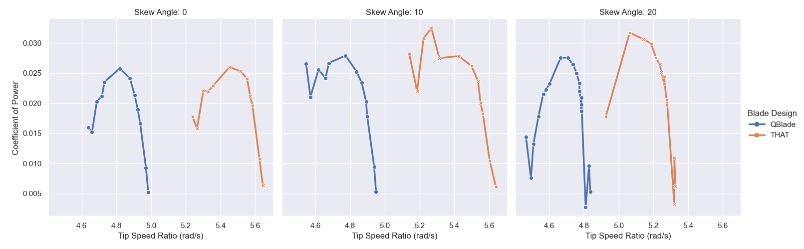

# MAE-Research

    

This code was written for reading in and processing sensor data for the NCSU MAE EMSSL undergraduate research team.

  

The data was captured from two sources: LabVIEW and and Oscilloscope.
The LabVIEW program was responsible for recording force (X, Y, Z), torque (X, Y, Z), RPM, and motor current
The Oscilloscope also recorded motor current. Due to the accuracy of the oscilloscope being higher, its current data was used to perform calculations

